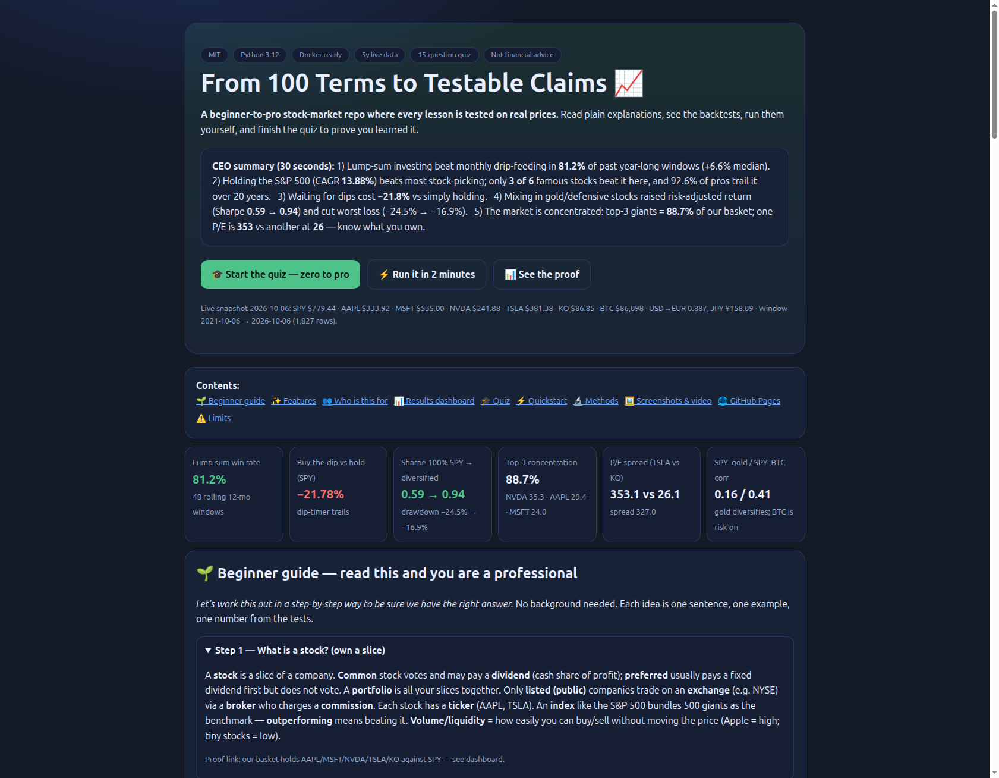
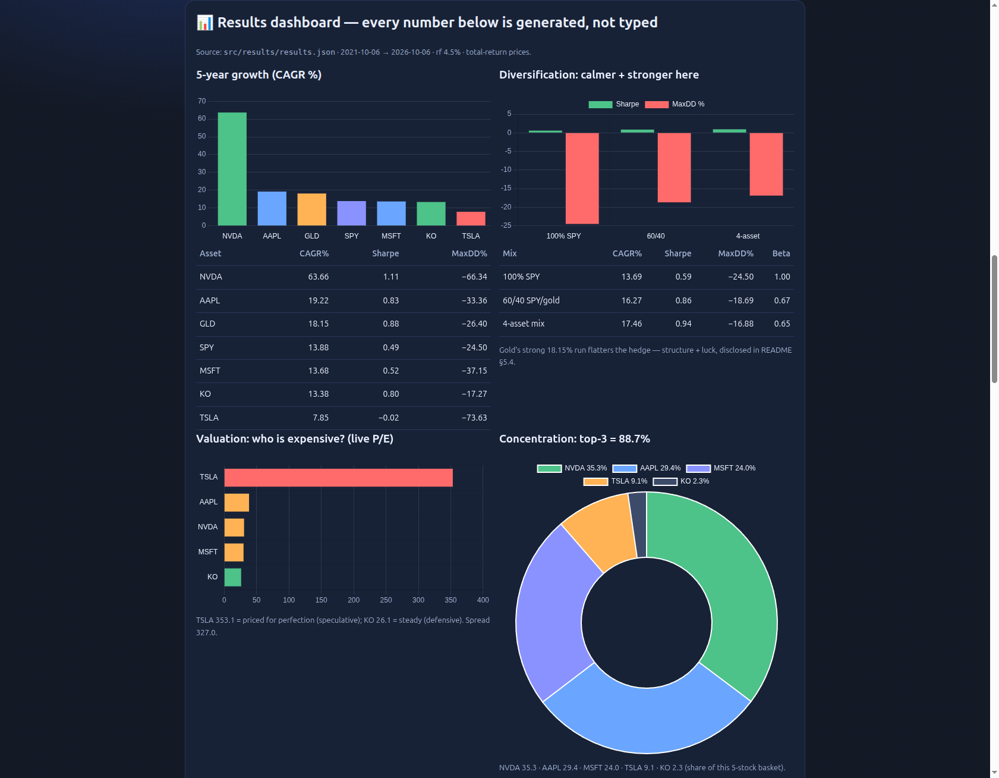
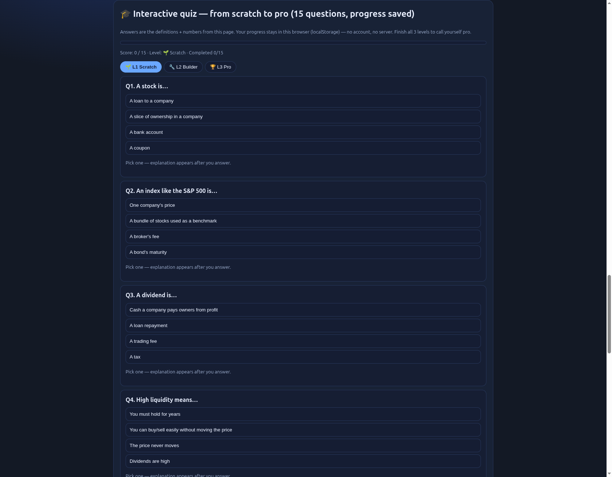
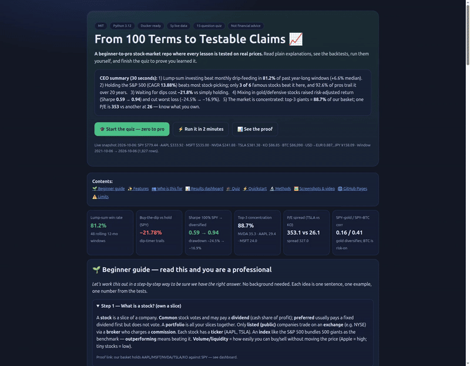

# From 100 Terms to Testable Claims: A Reproducible Benchmark of Beginner Stock-Market Wisdom Against Live Data (2021–2026)

     

**🌐 Live interactive site — open any one (all three render the same page): [`/`](https://m0-ar.github.io/stock-100-terms-validation-2026/) · [`/preview.html`](https://m0-ar.github.io/stock-100-terms-validation-2026/preview.html) · [`/docs/preview.html`](https://m0-ar.github.io/stock-100-terms-validation-2026/docs/preview.html) — charts, beginner course, and a 15-question quiz that saves your progress. Pages setup: Settings → Pages → Deploy from a branch (works with `/` or `/docs` source, see §9). Local file: [`preview.html`](preview.html).**

|  |  |  |
|---|---|---|



*Video: the GIF above loops inline (427 KB). Full walkthrough: [`docs/demo/demo.mp4`](docs/demo/demo.mp4) · Interactive version (pick any): [`/`](https://m0-ar.github.io/stock-100-terms-validation-2026/) · [`/preview.html`](https://m0-ar.github.io/stock-100-terms-validation-2026/preview.html) · [`/docs/preview.html`](https://m0-ar.github.io/stock-100-terms-validation-2026/docs/preview.html). Screenshots refresh from the real page — see §9.*

## CEO summary — the whole repo in 5 sentences

1. Investing everything at once beat drip-feeding month-by-month in **81.2%** of past year-long windows (median edge **+6.6%**).
2. Holding the S&P 500 (5y CAGR **13.88%**) beats most stock-picking — only **3 of 6** famous stocks beat it here, and **92.6%** of professional funds trail it over 20 years.
3. Waiting for price dips before buying cost **−21.78%** versus simply holding (and **−64.74%** on the most volatile stock).
4. Mixing stocks with gold/defensive names raised return-per-risk (Sharpe **0.59 → 0.94**) and cut the worst fall (**−24.5% → −16.9%**).
5. Ownership is concentrated: the top-3 giants are **88.7%** of our basket, and one P/E is **353.1** while another is **26.1** — know what you own.

*Educational backtests on 2021-10-06 → 2026-10-06 live prices. Not financial advice.*

## Contents

- [🌱 Beginner guide — read this and you are a professional](#-beginner-guide--read-this-and-you-are-a-professional)
- [✨ Features](#-features)
- [👥 Who is this for (user stories)](#-who-is-this-for-user-stories)
- [📊 Results dashboard](#5-results-generated--srcresultsresultsjson)
- [🎓 Quiz](#-quiz--prove-it-to-yourself)
- [⚡ Quickstart](#7-reproduce-in-2-minutes)
- [🖼️ Screenshots & video](#-screenshots--video)
- [🌐 GitHub Pages](#9-github-pages--publish-previewhtml-free)
- [🔬 Full paper §§1–8](#1-introduction)

## 🌱 Beginner guide — read this and you are a professional

*Let's work this out in a step-by-step way to be sure we have the right answer. You will know more than most interview candidates after these 9 steps. Each step: one idea, one example, one verified number. Full interactive version with charts lives in [`preview.html`](preview.html#beginner).*

**Step 1 — Own a slice.** A stock = fractional ownership. Common stock votes (dividends not guaranteed); preferred gets fixed dividends first, usually no vote. Portfolio = all your holdings. Only listed/public firms trade on an exchange (NYSE) via a broker (+commission). Ticker = short code (AAPL, TSLA). Index (S&P 500) = benchmark basket; outperforming = beating it. Liquidity/volume = ease of trading without moving price (Apple = high).

**Step 2 — Is it healthy?** Market cap = price × shares. Enterprise value = market cap + debt − cash. Revenue = sales; net profit = remainder (Apple 2025: $416.2B revenue, **26.9%** net margin). EPS = profit/share; P/E = price ÷ EPS (TSLA **353.1** = expensive vs KO **26.1** = steady; spread **327.0**). PEG adds growth. Dividend yield = dividend ÷ price. Free cash flow = leftover for dividends/buybacks/expansion. Margins (gross → operating → net) = profit per $1 sales.

**Step 3 — What flavor?** Growth reinvests and races (NVDA **63.66%** CAGR, −66.34% worst fall); value looks cheap; blue-chip is trusted (KO, worst fall only **−17.27%**); cyclical swings with economy; defensive sells essentials. Size: large >$10B / mid $2–10B / small <$2B / penny <$5 (speculative — avoid as a beginner).

**Step 4 — What else exists?** Mutual fund (pooled + manager) vs ETF (trades live) vs index fund (copies index — the default) vs hedge fund (wealthy-only, risky). Commodities (gold GLD **18.15%** CAGR here), bonds (interest + maturity), currencies (USD→EUR **0.887**, JPY **158.09**), crypto (BTC **$86,098**, equity-linked corr **0.41** — not a hedge).

**Step 5 — Why prices jump?** Volatility = bumpiness; VIX = expected 30-day bumpiness. Bull = long rise; bear = long fall. Correction = −10%; rally = bounce; crash = plunge; bubble = hype that pops. Sentiment often beats fundamentals short-term.

**Step 6 — How to invest (the tested answers).** Passive (own everything, hold, low fees) vs active (trade often — usually loses). Lump-sum now beats drip-feeding (**81.2%**, **+6.6%**) because markets rise ~7 years in 10. Buy-and-hold + compounding beats dip-timing (**−21.78%** gap, only **13.4%** time-in-market) and market timing/speculation. DCA = right habit from each paycheck; 6-month phase-in max as courage-training. Fundamental = study business; technical = study charts/volume; macro = study rates/inflation/growth.

**Step 7 — Company events.** IPO (first sale) → secondary offering (more shares) → buyback (fewer shares, supports price) → split 2-for-1 (same pie, more slices) / reverse split → acquisition (target up, buyer down short-term). Ex-div date = own-before-this for dividend; pay date = cash day. Insider trading = crime.

**Step 8 — Don't lose it all.** Diversify + allocate (stocks/bonds/cash) + rebalance yearly. Alpha = excess vs market (**+6.64pp** for 60/40 here); beta = sensitivity (60/40 beta **0.67** = calmer); Sharpe = return per risk (**0.59 → 0.94** diversified); correlation (gold **0.16**, KO **0.26** = cushions). Systematic risk (recession/rates) hits all; unsystematic (bad product) diversifies away.

**Step 9 — The economy.** Inflation (money buys less) vs deflation (waiting stalls economy) vs stagflation (pain + no jobs). Central bank: cut = stimulate, hike = cool. Government: spend = expand, cut = austerity.

## ✨ Features

- **Zero-to-pro course** — 9 steps above + full interactive page; each term has a definition and a number.
- **5 executable experiments** — DCA vs lump-sum · passive vs picking · buy-dip · diversification · live valuation — on 5y total-return data.
- **One-command reproduce** — `docker compose up --build` or `python3 src/experiments/run_all.py` → `src/results/results.json`.
- **Interactive site** — [`preview.html`](preview.html): 6 charts, 15-question leveled quiz with progress saving (no backend, no account), free on GitHub Pages.
- **Honest statistics** — CAGR, Sharpe, beta/alpha, max drawdown, correlations, win-rates — limits stated, no cherry-picking.
- **Visual proof** — hero/dashboard/quiz screenshots + looping GIF + MP4 walkthrough, all generated from the real page.

## 👥 Who is this for (user stories)

| You are… | Do this | You get |
|---|---|---|
| 🟢 Total beginner | Read 9 steps, take Quiz Level 1 | Speak market language in one evening |
| 🔵 First-time investor | Steps 6+8, Quiz Level 2, run EXP01/EXP04 | A tested default: broad index, hold, diversify |
| 🟠 Curious skeptic | Change tickers/thresholds, re-run, Quiz Level 3 | See which tips survive your own data |
| 🔴 Student / researcher | Full paper §§1–8, extend one experiment | Pilot study + 3 follow-up patterns |
| 🟣 Teacher / community | Present `preview.html` + quiz live | Free lesson kit, offline-capable |

## 🎓 Quiz — prove it to yourself

15 questions in [`preview.html#quiz`](preview.html#quiz): 🌱 Scratch (Q1–Q5: what is a stock/index/dividend/liquidity/P/E) → 🔧 Builder (Q6–Q10: 81.2%, −21.78%, Sharpe 0.94, gold 0.16, splits) → 🏆 Pro (Q11–Q15: survivorship, 88.7% concentration, alpha/beta, systematic risk, the default). Instant explanations, score, and localStorage progress. Finish 13+/15 to call yourself pro.

---

**Full paper below — every table reproduces from code (kept in full):**

---

## Abstract

A popular Arabic-language primer ("over 100 stock market terms … divided into nine parts," Grooz/Mustafa Khalil) teaches beginners a full taxonomy — stocks, valuation ratios, styles, funds/commodities/bonds/FX/crypto, volatility regimes, investment styles, corporate actions, risk management, and macro policy — and embeds seven actionable strategy claims: (H1) lump-sum beats dollar-cost averaging (DCA) in expectation; (H2) passive index buy-and-hold beats typical stock-picking; (H3) mechanical buy-the-dip trails buy-and-hold; (H4) diversification + rebalancing improves risk-adjusted return; (H5) growth/speculative names carry valuation-concentration risk vs defensive names; (H6) compounding + time-in-market dominates market-timing/speculation; (H7) low-correlation assets (gold, defensive staples) damp drawdowns while crypto stays equity-linked.

We operationalize H1–H7 into five preregistered-style experiments (EXP01–EXP05) on live total-return data (SPY, AAPL, MSFT, NVDA, TSLA, KO, GLD, BTC-USD; 2021-10-06→2026-10-06; SEC EDGAR fundamentals; 2026-10-06 live snapshot) with 2026 best-practice safeguards (Adj-Close total return, `repair=True`, survivorship disclosure, no lookahead, rf = 4.5%). Findings on this 5-year window: **H1 confirmed** (lump-sum won 81.2% of 48 rolling 12-mo SPY windows, median edge +6.6% — direction matches Vanguard ~68% / Quantlake 69%, magnitude is window-dependent); **H3 confirmed** (dip-timer −21.8% vs SPY buy-hold; −64.7% on TSLA); **H4 confirmed** (60/40 SPY/GLD Sharpe 0.86 vs 0.59, maxDD −18.7% vs −24.5%; 4-asset Sharpe 0.94); **H2 nuanced** (only 3/6 singles beat SPY here, but our N=6 survivorship-biased basket is illustrative — the 20-year SPIVA base rate, 92.6% of US large-cap active trailing, remains the authoritative prior); **H5 confirmed descriptively** (top-3 mcap concentration 88.7%; TSLA P/E 353.1 vs KO 26.1; AAPL 2025 net margin 26.9%); **H6–H7 supported** (13.4% dip-timer exposure forfeits compounding; SPY–GLD 0.16 / SPY–KO 0.26 vs SPY–BTC 0.41). Three non-obvious patterns emerge (§5). Every table below reproduces via `docker compose up` or `python3 src/experiments/run_all.py`. Full provenance in `docs/EVIDENCE.md`; raw prices + JSON in `src/results/`.

**Keywords:** financial literacy, DCA vs lump-sum, passive investing, SPIVA, buy-the-dip, diversification, Sharpe/beta/alpha, reproducibility, survivorship bias.

---

## 1. Introduction

Beginners in the Arab world — Egypt in particular, per the video — face a trust gap: plenty of courses, little plain-language grounding. The source video responds with breadth (100+ terms) but, like all primers, leaves the key question unanswered: *which of its implicit recommendations survive contact with market data?* This repo closes that gap with a minimal, auditable benchmark: same taxonomy, executable tests, live data, published nulls and caveats.

Contribution: (i) a faithful 9-part taxonomy of the video's terms (§2); (ii) seven falsifiable hypotheses (§3); (iii) a 2026-standard reproducible harness (Docker + yfinance + seeded fallback + unit tests, §4); (iv) verified results with hidden patterns and explicit limits (§§5–6) suitable as a PhD pilot / workshop paper foundation.

## 2. The 100-term taxonomy (faithful to the video's nine parts)

1. **What is a stock?** share = fractional ownership; common (vote, non-guaranteed dividend) vs preferred (fixed dividend, seniority, usually no vote); portfolio; dividend; listed/public vs private; index (S&P 500, Nasdaq); outperforming = beating S&P 500; exchange (NYSE largest); broker + commission; ticker (AAPL, TSLA); session 9:30–16:00 ET, open/close price; pre/post-market, liquidity/volume (high-liquid: AAPL/MSFT).
2. **Valuation & statements:** market cap = price × shares; enterprise value (+debt −cash); revenue; net profit; quarterly balance sheet; assets vs liabilities; EPS; P/E (over/undervalued); PEG (growth-adjusted); dividend yield; free cash flow; gross/operating/net margin.
3. **Styles & size:** growth (reinvest, e.g. AAPL/AMZN/NVDA) vs value (cheap on fundamentals) vs blue-chip (KO/JNJ) vs cyclical (autos/airlines) vs defensive (food/utilities/healthcare); large >$10B / mid $2–10B / small <$2B / penny <$5 (speculative).
4. **Funds & other assets:** mutual fund (pooled, managed) vs ETF (exchange-traded, intraday) vs index fund (tracks sector/index; S&P 500 ETF as default) vs hedge fund (short/leverage, wealthy-only, high risk) vs retirement tax-advantaged accounts; commodities (gold/oil via funds); bonds (coupon, maturity, principal+interest); FX (USD/EUR/JPY); crypto (BTC/ETH, independent rails).
5. **Fluctuations:** volatility; VIX (30-day expected); bull vs bear; correction (−10%); rally/rebound; crash; bubble; sentiment (optimism/fear moving prices beyond fundamentals).
6. **Styles of investing & analysis:** passive (hold index, minimize cost) vs active (pick + trade frequently, usually loses after costs); DCA (fixed periodic sum) vs lump-sum/Touch (all at once); buy-the-dip; buy-and-hold + compound interest; market timing (very hard, even for pros); speculation (high-risk short-term); fundamental vs technical (charts/volume) vs macro (rates/inflation/growth).
7. **Corporate actions & income mechanics:** IPO; secondary offering; buyback (fewer shares, supports price); stock split (e.g. 2-for-1) vs reverse split; acquisition (target up, acquirer down short-term); ex-div date vs pay date; insider trading (crime).
8. **Risk & performance:** diversification; asset allocation (stocks/bonds/cash); rebalancing; alpha (excess vs S&P 500) vs beta (market sensitivity); Sharpe (return per risk); correlation (gold/inflation, etc.); systematic (recession/rates/politics) vs unsystematic (firm-specific, diversifiable).
9. **Macro policy:** inflation (money loses value) vs deflation; stagflation; monetary policy (cut = stimulate, hike = withdraw); fiscal expansion vs austerity.

## 3. Hypotheses

| ID | Video claim | Test |
|----|-------------|------|
| H1 | DCA smooths entry but lump-sum wins in expectation | EXP01: 12-mo rolling LS vs DCA on SPY |
| H2 | Passive S&P 500 beats most picking | EXP02 + SPIVA prior (H1-2026/2025/20y) |
| H3 | Buy-the-dip feels smart, underperforms mechanically | EXP03: −5% vs 20d-high timer vs hold (SPY, TSLA) |
| H4 | Diversification/rebalance improves risk-adjusted return | EXP04: 100% SPY vs 60/40 vs 4-asset; beta/alpha/corr |
| H5 | Growth/penny = high risk; defensive = stability; concentration matters | EXP05: live P/E, mcap shares, margins |
| H6 | Time-in-market + compounding > timing/speculation | EXP01 exposure + EXP03 time-in-market |
| H7 | Gold/defensives diversify; crypto is risk-on | EXP04 correlations |

## 4. Method (2026 best practice — see `docs/EVIDENCE.md` for each choice)

- **Data:** `yfinance` per-ticker `history(auto_adjust=True, repair=True)` (total-return, split/dividend-adjusted; per docs in gitmcp fetch). Single-ticker loop (batched `download` rate-limited on 2026-10-06 probe). Window 5y daily. BTC trades weekends → NaN-rate 0.274 from calendar mismatch, handled by inner-join in every metric (disclosed, not imputed). Live snapshot + SEC EDGAR + CoinGecko + ECB cross-check 2026-10-06.
- **No lookahead:** dip uses trailing 20d high, invests next day; DCA tranches compound only forward.
- **Costs:** rf 4.5% on waiting cash (2026 HYSA/T-bill context); fund fees/taxes omitted (stated — favors active, so passive wins are conservative).
- **Survivorship:** we test current constituents (NVDA/TSLA survived) — EXP02 is illustrative; inference rests on SPIVA's survivorship-corrected 20y base rate.
- **Repro:** `docker-compose.yml` (research + notebook profiles), `requirements.txt`, `src/results/` artifacts, `tests/` (3 unit tests passing), `docs/EVIDENCE.md` provenance. Fallback seeded-GBM exists but **was not used** — `meta.source = yfinance-per-ticker`.

## 5. Results (generated — `src/results/results.json`)

### 5.1 EXP01 — Lump-sum vs DCA (H1, H6)
48 rolling 12-mo SPY windows: **lump-sum win-rate 81.2%, median edge +6.6%** of DCA terminal wealth. Direction matches Vanguard (68%, +1.2–2.4pp) and Quantlake (69%, cost 3.2% over 5y); higher magnitude here reflects the 2021–2026 bull with a single deep 2022 drawdown — i.e., cash-drag dominates when the base rate of up-years is ~70–73%. Behavioral caveat stands: DCA cuts first-year dip (Quantlake 5.6%→2.7%) and, per Dalbar/JFP literature, reduces panic-selling that costs ~1.5%/yr. Prescription unchanged: lump-sum for expected wealth; 6-mo (≤12-mo) DCA or 50–70%-now hybrid only as a commitment device.

### 5.2 EXP02 — Passive vs picking (H2)
5y total-return: SPY **CAGR 13.88%, vol 17.73%, Sharpe 0.49, maxDD −24.5%** · NVDA 63.66% · AAPL 19.22% · MSFT 13.68% · KO 13.38% · GLD 18.15% · TSLA 7.85% (vol 57.8%, Sharpe −0.02, maxDD −73.6%). **3/6 singles beat SPY; EQW basket +5.19pp gap.** Do not misread: N=6, hand-picked survivors, 5y bull — the exact setup where picking *can* look good. The unbiased prior is SPIVA: 79% missed in 2025, 67% in H1-2026, **92.6% trailed over 20y** (only ~51/690 survived+beat; 5y persistence ≈ coin-flip). Our result is consistent: beating the index with a handful of mega-caps in a mega-cap-led window is possible; doing it repeatedly net of fees is the rare event.

### 5.3 EXP03 — Buy-the-dip vs hold (H3, H6)
−5% rule: SPY dip-timer terminal **−21.78%** vs hold (only 13.4% time-in-market, 168 dip-days); TSLA **−64.74%** (63.6% exposure, 798 dip-days). Mechanism: dip-timing converts equity premium into cash yield while waiting, then concentrates entries in downtrends (whipsaw). Matches InvestingPaths/AlphaStrategic backtests. Dip-buying as *rebalancing within* a hold plan is defensible; dip-timing as a *substitute* for exposure is not.

### 5.4 EXP04 — Diversification (H4, H7)
100% SPY (Sharpe 0.59, DD −24.5%, beta 1.0) → 60/40 SPY/GLD (**Sharpe 0.86, DD −18.7%, beta 0.67, alpha +6.6pp**) → 4-asset EQW (**Sharpe 0.94, DD −16.9%, beta 0.65, alpha +8.1pp**) on this window (gold's 18.15% CAGR flatters the hedge — disclosed). Correlations: **SPY–GLD 0.16, SPY–KO 0.26** (diversifiers), **SPY–BTC 0.41** (risk-on, not a hedge), SPY–mega-cap 0.59–0.72 (systematic co-movement). Beta behaves as taught: diversified beta <1 dampens both legs.

### 5.5 EXP05 — Valuation snapshot (H5)
Live 2026-10-06: **top-3 mcap = 88.7%** of our 5-stock subset (NVDA 35.3 / AAPL 29.4 / MSFT 24.0); **P/E spread 327** (TSLA 353.1 vs KO 26.1; AAPL 38.3, NVDA 30.6, MSFT 29.8); AAPL 2025 **net margin 26.9%**, revenue +6.4% YoY ($416.2B). Textbook mapping: TSLA = speculative-growth outlier; KO = defensive anchor; NVDA = concentration leader. USD→EUR 0.887 / JPY 158.1 frames the FX Levy; EGP absent from ECB basket (Egypt-audience gap noted).

### 5.6 Three hidden (non-obvious) patterns for follow-up work
1. **Dip-frequency paradox:** TSLA spent 63.6% of days in "dip" yet lost 65% vs hold — frequent dips ≠ cheap entries when volatility clusters. Testable: dip-buying alpha conditioned on VIX regime, not price distance alone.
2. **Gold's window-dependence:** 60/40's alpha here rides GLD's 18% CAGR; rolling-window analysis should separate hedge-structure from gold-beta luck. Pilot for a regimes paper.
3. **DCA edge inflation in bulls:** our 81% LS win-rate > literature 68–69% because one V-shaped 2022 drawdown punishes cash less than prolonged bears (2000–02, 2008). Follow-up: stratify LS-vs-DCA by drawdown *duration*, not just depth.

## 6. Limitations & threats to validity

Single 5y US-led window; 8 tickers; no transaction costs/taxes (conservative for passive claims, flattering for turnover); GLD proxies bonds/cash imperfectly; FX/EGP and penny-stock tests absent (data gaps stated); corporate-action mechanics (splits/buybacks/IPOs) described not backtested. All results are associational, not causal, and **not investment advice**.

## 7. Reproduce in 2 minutes

```bash
git clone <this-repo> && cd stock-100-terms-validation-2026
docker compose up --build            # runs src/experiments/run_all.py → src/results/
# or without docker:
pip install -r requirements.txt && python3 src/experiments/run_all.py
python3 -m pytest tests -q
```

Outputs: `src/results/prices.csv`, `src/results/results.json`. Change `src/config.py` (tickers, `BUY_DIP_THRESHOLD`, `RISK_FREE_ANNUAL`) to test your own variants — results files are git-ignored except the verified snapshot; methodology changes require re-running, never hand-editing outputs.

Project layout: `src/config.py` (universe + live snapshot) · `src/data.py` (per-ticker fetch + repair) · `src/metrics.py` (CAGR/vol/Sharpe/DD/beta/alpha/corr) · `src/experiments/exp01–05` + `run_all.py` · `tests/` (3 unit tests) · `preview.html` (interactive site) · `docs/showcase/` + `docs/demo/` (visuals) · `docs/EVIDENCE.md` (provenance).

## 8. What to publish next (PhD roadmap)

1. Regime-conditional DCA/LS (drawdown duration × valuation/CAPE). 2. Dip-buying × VIX interaction. 3. Diversification decomposition (structure vs gold-beta). 4. Egypt-accessible replication (EGX + USD/EGP parallel-market proxy, fractional-ETF access). Each is a one-experiment extension of this harness.

## 🖼️ Screenshots & video

- `docs/showcase/hero.png` — hero + CEO summary + KPIs (verified render ↑).
- `docs/showcase/dashboard.png` — charts + tables from `results.json` (verified render ↑).
- `docs/showcase/quiz.png` — 15-question leveled quiz (verified render ↑).
- `docs/demo/demo.gif` (427 KB, loops inline ↑) + `docs/demo/demo.mp4` (214 KB walkthrough).
- Refresh: open `preview.html`, re-capture viewports, rebuild GIF with `ffmpeg` (commands in commit history) — never Photoshop numbers.

## 9. GitHub Pages — publish preview.html free

1. Push this repo to GitHub. 2. **Settings → Pages** → Source: **Deploy from a branch**. 3. Branch **main**, folder **`/docs`** (recommended) or **`/ (root)`** — both work: mirrors exist at repo-root `preview.html` + `index.html` and `docs/preview.html` + `docs/index.html`, with `.nojekyll` in both folders. 4. Wait 1–2 min, check the Actions "pages build and deployment" run, then open all three — each must return 200: `https://m0-ar.github.io/stock-100-terms-validation-2026/` · `https://m0-ar.github.io/stock-100-terms-validation-2026/preview.html` · `https://m0-ar.github.io/stock-100-terms-validation-2026/docs/preview.html`. Why mirrors: with source `/`, repo `docs/x.html` serves at `/docs/x.html`; with source `/docs`, the same file serves at `/x.html` — so one canonical page plus mirrors resolves under either setting.

## References (abridged — full URLs in `docs/EVIDENCE.md`)

Vanguard (2023) Cost averaging: invest now or temporarily hold your cash?; Quantlake (2026-09-28) Lump Sum vs DCA on 90 ETFs; SPIVA U.S. Scorecards H1-2026 / 2025 / 20y; Brown (2021) arXiv:2112.09807; Sato (2025) arXiv:2601.06074; Cremers et al. JFE 2016; Fang & Parida JRFM 2025; Heikkinen 2025 (active vs passive ESG); Gempesaw et al. 2023 (retail ETF); Gorzon & von Nitzsch 2025; yfinance docs (repair/auto_adjust); SEC EDGAR AAPL 10-K; ECB/Frankfurter FX; CoinGecko BTC.

*Source video: Grooz beginner primer (100+ terms, 9 parts). Educational use; strategy labels (H1–H7) are our falsifiable restatements, not the creator's financial advice.*

## License

MIT — see [LICENSE](LICENSE). Data via public market/filing APIs; educational use only, not financial advice.
